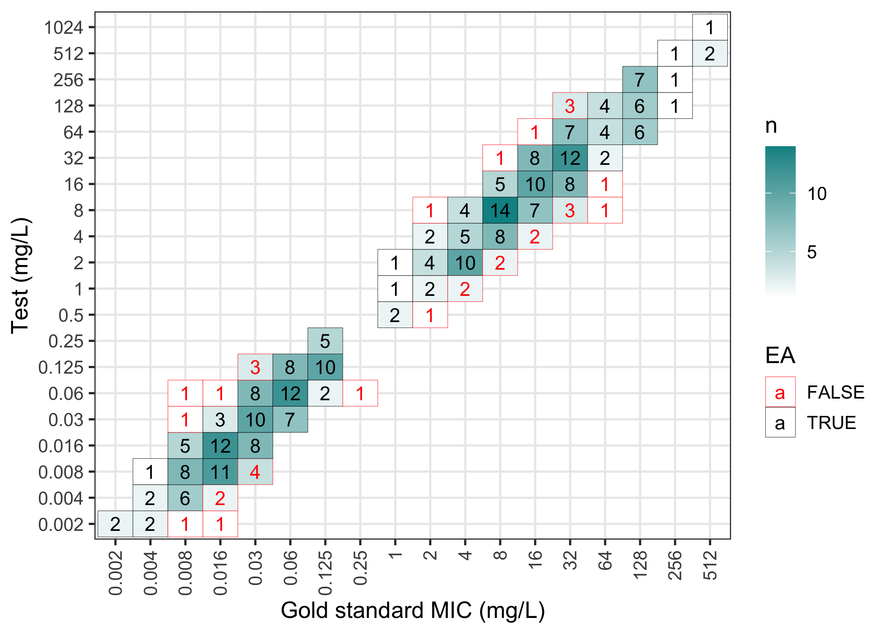
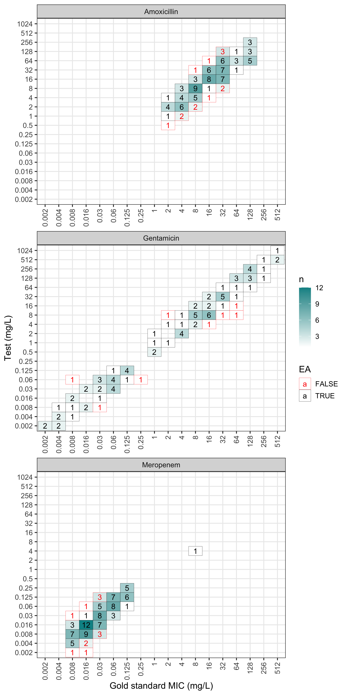

<!-- README.md is generated from README.Rmd. Please edit that file -->

# MIC

<!-- badges: start -->

[](https://github.com/agerada/MIC/actions/workflows/R-CMD-check.yaml)
<!-- badges: end -->

## Important updates

As of version 2.0.0 the MIC package has being refocused to provide
MIC-specific analysis and validation utilities. Genomics-related
functions (PATRIC download helpers, genome -\> $k$-mer conversion,
$k$-mer utilities, and similar) have been ported to a new package,
[`faLearn`](https://github.com/agerada/faLearn).

To continue using these functions, simply install and load the `faLearn`
package alongside `MIC`:

``` r
# install.packages("remotes")
remotes::install_github("agerada/faLearn")
library(faLearn)
```

## Introduction

`MIC` is an R package for the analysis of minimum inhibitory
concentration (MIC) data. The package was designed to be compatible with
the [`AMR`](https://amr-for-r.org/), in particular most of the functions
in `MIC` are designed to accept and return `AMR` objects, such as `mic`
and `sir`. The primary functions in `MIC` are designed towards
validation studies of minimum inhibitory concentrations, however it also
can (optionally) be used to support the construction of machine learning
models that predict MIC values from genomic data.

## Features

- Validation metrics (such as essential agreement) for MIC experiments
  or predictions allow comparison against a gold standard, in line with
  ISO 20776-2:2021.
- Plots and tables can be generated from validation experiments.
- Quality control analysis of MIC experiments.
- Functions to deal with censoring in MIC data.
- Helper functions to download whole genome sequencing data and
  susceptibility metadata from the
  [PATRIC](https://www.bv-brc.org/docs/system_documentation/data.html)
  database at BV-BRC.
- Conversion of whole genome sequence data (assembled .fna files) to
  k-mer based features for machine learning models.
- Fast k-mer counting using C++ and `Rcpp`.
- K-mer features stored in `XGBoost`-compatible `libsvm` format.

## Installation

### CRAN

``` r
install.packages("MIC")
```

### GitHub

``` r
# install.packages("remotes")
remotes::install_github("agerada/MIC")
```

## Example

Load the `MIC` package – it is highly recommended that `AMR` is also
loaded. Where possible, `MIC` functions maintain compatibility with
`AMR` objects, in particular the `mic` and `sir` classes.

``` r
library(MIC)
#> 
#> Attaching package: 'MIC'
#> The following object is masked from 'package:base':
#> 
#>     table
library(AMR)
```

To compare two `mic` vectors (e.g., one from a gold standard and one
from a prediction or investigational assay), the `compare_mic` function
can be used. An example dataset of MIC values is provided with the
package, which will be used here.

``` r
data("example_mics")
head(example_mics)
#>      gs  test           mo  ab
#> 1 0.002 0.002 B_ESCHR_COLI GEN
#> 2 0.004 0.002 B_ESCHR_COLI GEN
#> 3     8    16 B_ESCHR_COLI GEN
#> 4 0.008 0.016 B_ESCHR_COLI GEN
#> 5    64    64 B_ESCHR_COLI GEN
#> 6  0.06  0.06 B_ESCHR_COLI GEN
```

The dataset contains MIC values (in `mic` format) for a “test” assay,
and a “gold standard” (`gs`) assay. We will use `compare_mic` to compare
the MICs and validate the “test” assay:

``` r
val <- compare_mic(gold_standard = example_mics$gs, test = example_mics$test)
val
#> MIC validation object with 300 observations
#> Agreement type: essential
```

Calling `summary` provides the essential agreement (EA) rates and assay
bias:

``` r
summary(val)
#> MIC validation summary
#> Essential agreement: 267 (89%)
#> Bias: -7
```

If organisms and antimicrobials are provided, `compare_mic` will also
calculate and return the categorical agreement (CA) rates, in the form
of minor, major, and very major errors:

``` r
val <- compare_mic(gold_standard = example_mics$gs, test = example_mics$test,
                   mo = example_mics$mo, ab = example_mics$ab)
val
#> MIC validation object with 300 observations
#> Agreement type: essential and categorical
#> Antibiotics: GEN, MEM, AMX
#> Organisms: B_ESCHR_COLI
```

This time, calling `summary` will provide a breakdown of the categorical
agreement rates in addition to the EA rates:

``` r
summary(val)
#> MIC validation summary
#> Antibiotic: AMX, GEN, MEM
#> Organism: B_ESCHR_COLI
#> Essential agreement: 267 (89%)
#> Resistant: 113 (37.67%)
#> Minor errors: 0 (0%)
#> Major errors: 6 (2%)
#> Very major errors: 8 (2.67%)
#> Mean bias: -7
#> N: 300
#> *Use as.data.frame() to see full summary*
```

Using `as.data.frame` allows us to continue working with the summarised
results:

``` r
head(as.data.frame(val))
#>   gold_standard  test essential_agreement  ab           mo gold_standard_sir
#> 1         0.002 0.002                TRUE GEN B_ESCHR_COLI                 S
#> 2         0.004 0.002                TRUE GEN B_ESCHR_COLI                 S
#> 3             8    16                TRUE GEN B_ESCHR_COLI                 R
#> 4         0.008 0.016                TRUE GEN B_ESCHR_COLI                 S
#> 5            64    64                TRUE GEN B_ESCHR_COLI                 R
#> 6          0.06  0.06                TRUE GEN B_ESCHR_COLI                 S
#>   test_sir error
#> 1        S  <NA>
#> 2        S  <NA>
#> 3        R  <NA>
#> 4        S  <NA>
#> 5        R  <NA>
#> 6        S  <NA>
```

The results of an `mic_validation` can be plotted in a confusion matrix
(failed essential agreements are in red):

``` r
plot(val)
```



The plot can also be faceted by antimicrobial:

``` r
plot(val, facet_wrap_ncol = 1)
```



The `table` function can be used to generate a table of the results:

``` r
# generate table for MEM
mem_dat <- subset(example_mics, ab == "MEM")
mem_val <- compare_mic(gold_standard = mem_dat$gs, test = mem_dat$test)
table(mem_val)
```


